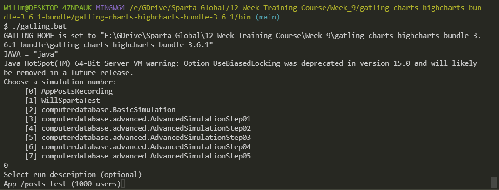
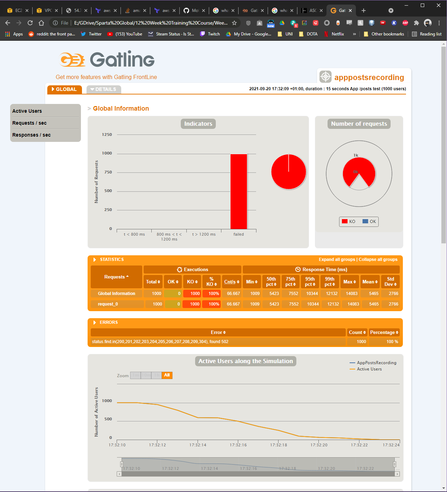
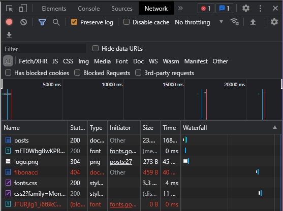
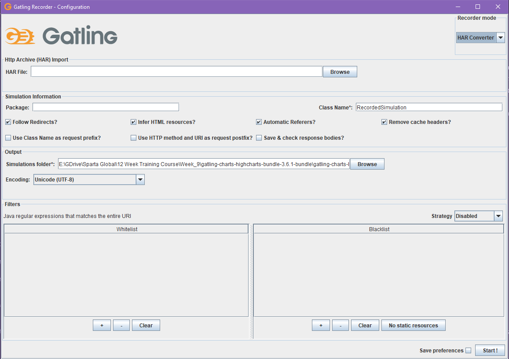

# Performance Testing
## Gatling
Gatling is an open-source load and performance-testing framework based on **Scala**, **Akky** and **Netty**. The application is designed to be used as a load testing tool for analyzing and measuring the performance of a variety of services, with a focus on web applications.

## Scala
Scala is a programming language. Gatling simulation scripts are written in Scala.

## Intellij
Intellij is an IDE specifically designed for Java. It created by *JetBrains*, the same developers that created *PyCharm*. Pycharm is essentially the *Python version* of Intellij (or vice-versa), that's why they look exactly the same.

## Setting up test ENV
In Intellij, we need to ensure that the **Scala** plugin is installed. Do this:

#### Intellij
- Plugins >> `ctlr + alt + s` >> Install Scala

#### VSCode
For VSCode, install the extensions:
- Scala Syntax (official)
- Scala (Metals)

## Gatling File Structure and using Gatling
The Gatling file structure should look something like this:
```
gatling-charts-highcharts-bundle-3.6.1/
├─ bin/
│  ├─ artifact.bat
│  ├─ gatling.bat
│  ├─ recorder.bat
├─ conf/
├─ lib/
├─ results/
│  ├─ TestFile01-101012351010/
│  │  ├─ index.html
│  ├─ TestFile02-202022352020/
├─ target/
├─ user-files/
│  ├─ resources/
│  ├─ simulations/
│  │  ├─ computerdatabase/
│  │  ├─ TestFile01.scala
│  │  ├─ TestFile02.scala
```

*The `bin` directory will also contain `.sh` files with the same name. The `.bat` files are for use with Window systems and the `.sh` files are for use with Mac and Linux systems.*

The `gatling.bat` runs Gatling. The user is then presented with options on what test/simulation to run. The user can then input a custom description for the test.



The simulation is then run and the details of the test are printed in the terminal. At the end of the test, the file path that is given can be put into the *Google Chrome* address bar to see a much nicer, tidier version of the test results.



The results of each test are also saved in the `results` directory. To the user friendly GUI as shown above, you can navigate to the test's result folder and copy the path of the `index.html` file. Paste this into the address bar on *Google Chrome* to obtain the page shown above.

### Making custom simulations by recording
It is possible to make a custom simulation by recording the process that you want to test. To do this, we need to use the `Inspect` function on *Google Chrome*. 



To create a custom simulation:
1. Open `Inspect` and go to the `Network` tab
    - **Ensure that the `Preserve log` box is checked**
2. Ensure that you are recording your network activity (the red record button)
3. Perform the actions that you would like to test.
4. When you've finished completing your desired processes, export the HAR file (by clicking the download button at the end of the controls) and save it wherever you like.
5. Navigate to the *Gatling Bundle* folder and run the `recorder.bat` file - A new window will appear:

    

    - In the `Recorder mode` section on the right hand side, select `HAR Converter`
    - Select the downloaded HAR file
    - Input a relevant `Class Name` *(this will be the simulation name)*
    - The simulation will be saved to the `Simulations folder` that is selected
    - Press `Start!` to convert the HAR file to a simulation

6. When you run `gatling.bat` the simulation will now be availble in the list of options.
7. The Scala simulation file can be found in `gatling-charts-highcharts-bundle-3.6.1/user-files/simulations/`. The file can also be edited. For example, to increase the number of users that the simulation will simulate, edit the final line in the script >> `setUp(scn.inject(atOnceUsers(1000))).protocols(httpProtocol)`
    - Change `1000` to whatever number you want